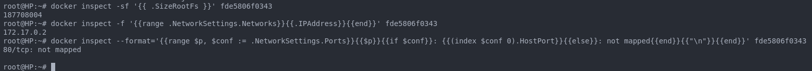

# Simple Docker

## Contents

1. [Part 1. Готовый докер](#chapter_1)
2. [Part 2. Операции с контейнером](#chapter_2)
3. [Part 3. Мини веб-сервер](#chapter_3)
4. [Part 4. Свой докер](#chapter_4)
5. [Part 5. Dockle](#chapter_5)
6. [Part 6. Базовый Docker Compose](#chapter_6)


## Part 1. Готовый докер<a name="chapter_1"></a>

* Возьмём официальный докер-образ с nginx и выкачаем его при помощи docker pull.

* Для этого выполним команду `docker login` и перейдем во вкладку браузера

  * Создадим аккаунт *docker*

    

* Прописываем команду `docker pull nginx`

  

* Запустим докер-образ через команду `docker run -d [image_id|repository]`

  

* Проверим, что образ запустился через `docker ps`

    

* Посмотрим информацию о контейнере через `docker inspect [container_id|container_name]`

  

  

* Определим размер контейнера, список замапленных портов и ip контейнера с помощью следующих команд

```
docker inspect -sf '{{ .SizeRootFs }}' fde5806f0343
docker inspect -f '{{range .NetworkSettings.Networks}}{{.IPAddress}}{{end}}' fde5806f0343
docker inspect --format='{{range $p, $conf := .NetworkSettings.Ports}}{{$p}}{{if $conf}}: {{(index $conf 0).HostPort}}{{else}}: not mapped{{end}}{{"\n"}}{{end}}' fde5806f0343
```

  

  1) Размер контейнера: **187708004 bytes**

  2) IP контейнера: **172.17.0.2**

  3) Список замапленных портов: **80/tcp: not mapped**

* Остановим докер контейнер через `docker stop [container_id|container_name]`

  

* Проверим, что контейнер остановился через `docker ps`

  

* Запустим докер с портами 80 и 443 в контейнере, замапленными на такие же порты на локальной машине, через команду `run`

  

* Проверим, что в браузере по адресу localhost:80 доступна стартовая страница nginx

  

* Перезапустим докер контейнер через `docker restart [container_id|container_name]`

  

## Part 2. Операции с контейнером<a name="chapter_2"></a>

* Прочитаем конфигурационный файл *nginx.conf* внутри докер контейнера через команду *exec*

  

* Создадим на локальной машине файл *nginx.conf*. Настроим в нем по пути /status отдачу страницы статуса сервера nginx.

  

* Скопируем созданный файл nginx.conf внутрь докер-образа через команду `docker cp`

  

* Перезапустим nginx внутри докер-образа через команду `exec`

  

* Проверим, что по адресу `localhost:80/status` отдается страничка со статусом сервера `nginx`

  

* Экспортируем контейнер в файл *container.tar* через команду *export*.

  

* Останавливаем контейнер

  

* Удаляем образ через `docker rmi [image_id|repository]`, не удаляя перед этим контейнер

  

* Удаляем остановленный контейнер

  

* Импортируем контейнер обратно через команду `import`

  

  > При импорте контейнера через *docker import*, информация о CMD может быть потеряна, если контейнер был экспортирован с помощью *docker export*. Это происходит потому, что *docker export* сохраняет только файловую систему контейнера, а не его метаданные или команду запуска. Поэтому мы явно указываем команду по умолчанию при импортировании контейнера

* Запустим импортированный контейнер

  

* Проверим, что по адресу *localhost:80/status* отдается страничка со статусом сервера *nginx*

  

## Part 3. Мини веб-сервер<a name="chapter_3"></a>

* Напишем мини-сервер на **C** и **FastCgi**, который будет возвращать простейшую страничку с надписью `Hello World!`

  

* Запустим написанный мини-сервер через *spawn-fcgi* на порту *8080*

  * Для этого создадим новый контейнер из образа *nginx* командой:
  
    ```
    docker run -d --name part_3 -p 81:81 nginx
    ```

    
  
  * Перейдем в терминал созданного контейнера командой `docker exec -it [CONTAINER ID | NAME] bash`

  * Установим на нем `gcc`, `libfcgi-dev` и `spawn-fcgi`

  * С помощью команды `docker cp` переместим в контейнер исходный код мини сервера

    

  * Скомпилируем исходный код и запустим мини сервер

  

* Напишем свой nginx.conf, который будет проксировать все запросы с *81* порта на *127.0.0.1:8080* и скопируем его в контейнер по пути *./nginx/nginx.conf*

  

* Перезагружаем сервер

  

* Проверим, что в браузере по *localhost:81* отдается написанная нами страничка

  

## Part 4. Свой докер<a name="chapter_4"></a>

* Напишем свой докер-образ, который:

  * собирает исходники мини сервера на FastCgi из Части 3;

  * запускает его на 8080 порту;

  * копирует внутрь образа написанный *./nginx/nginx.conf*;

  * запускает nginx.

  

* Собираем написанный докер-образ через `docker build` при этом указав имя и тег

  

* Проверим через `docker images`, что все собралось корректно

  

* Запустим собранный докер-образ с маппингом 81 порта на 80 на локальной машине и маппингом папки *./nginx* внутрь контейнера по адресу, где лежат конфигурационные файлы nginx'а

  > Для этого сначала вытащим из другого контейнера с *nginx* папку */etc/nginx* командой `sudo docker export 96f27863b481 -o tmp.tar`

  ```
  sudo docker run -d --name part_4 -p 80:81 -v $(pwd)/nginx:/etc/nginx my_server:s21
  ```

  

* Проверим, что по localhost:80 доступна страничка написанного мини сервера

  

* Допишем в *./nginx/nginx.conf* проксирование странички */status*, по которой надо отдавать статус сервера *nginx*

  

* Перезапустим докер-контейнер

  

* Проверим, что теперь по *localhost:80/status* отдается страничка со статусом *nginx*

  

## Part 5. Dockle<a name="chapter_5"></a>

* Просканируем образ из предыдущего задания через `dockle [image_id|repository]`

  

* Исправим образ так, чтобы при проверке через dockle не было ошибок и предупреждений

  

  * Собираем новый образ через редактированный докерфайл

  

  * Проверим через dockle

  

  > *INFO CIS-DI-0005* указывает на то, что у нашего образа отсутствует цифровая подпись. Чтобы добавить подпись нужно сгенерировать ее на локальной хост машине и на сервере, в который можно выгрузить этот образ (например dockerhub)

## Part 6. Базовый Docker Compose<a name="chapter_6"></a>

* Напишем файл docker-compose.yml, с помощью которого:

  * Поднимем докер-контейнер из Части 5 (он должен работать в локальной сети, т. е. не нужно использовать инструкцию EXPOSE и мапить порты на локальную машину).

  * Поднимем докер-контейнер с nginx, который будет проксировать все запросы с 8080 порта на 8081 порт первого контейнера.

  

* Сделаем для второго контейнера файл *nginx.conf*

  

* Остановим все запущенные контейнеры

  

* Соберем и запустим проект с помощью команд `docker compose build` и `docker compose up`

  

* Проверим, что контейнеры работают

  

* Проверим, что в браузере по localhost:80 отдается написанная нами страничка, как и ранее.

  

  